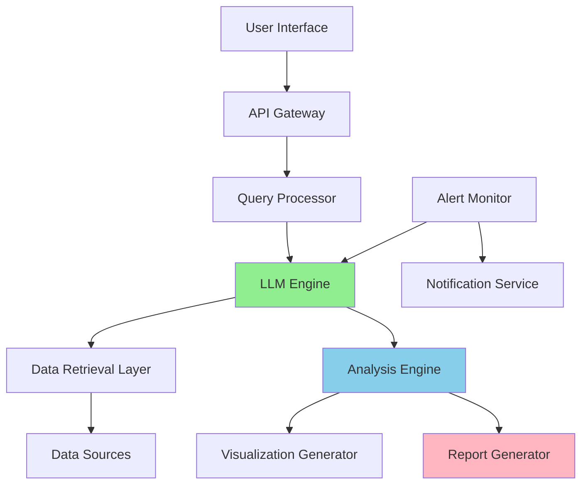

# AI Business Analyst - Implementation Plan

## Executive Summary

This document outlines the technical implementation plan for an AI-powered Business Analyst tool that transforms raw data into actionable insights through natural language interactions. The system will enable non-technical users to query business data conversationally and receive comprehensive reports with visualizations and narratives.

## Architecture Overview

### System Components



### Technology Stack

**Backend:**
- **Framework**: FastAPI (async support, automatic API docs)
- **LLM Integration**: OpenAI GPT-4 or Anthropic Claude (with LangChain)
- **Database**: PostgreSQL (structured data) + Redis (caching)
- **Data Processing**: Pandas, NumPy, SciPy
- **Task Queue**: Celery with Redis broker (for scheduled jobs)

**Frontend:**
- **Framework**: React with TypeScript
- **UI Library**: Material-UI or Shadcn/UI
- **Charting**: Recharts or Plotly.js
- **State Management**: Redux Toolkit or Zustand

**DevOps:**
- **Containerization**: Docker & Docker Compose
- **Orchestration**: Kubernetes (optional for production)
- **CI/CD**: GitHub Actions
- **Monitoring**: Prometheus + Grafana
- **Logging**: ELK Stack (Elasticsearch, Logstash, Kibana)

---

## Phase 1: Core Infrastructure (Weeks 1-2)

### 1.1 Project Setup

**Directory Structure:**
```
ai-business-analyst/
├── backend/
│   ├── app/
│   │   ├── api/              # API endpoints
│   │   ├── core/             # Config, security
│   │   ├── models/           # Database models
│   │   ├── services/         # Business logic
│   │   │   ├── llm/          # LLM integration
│   │   │   ├── data/         # Data connectors
│   │   │   ├── analysis/     # Analysis engine
│   │   │   └── visualization/# Chart generation
│   │   └── utils/            # Helpers
│   ├── tests/
│   ├── requirements.txt
│   └── Dockerfile
├── frontend/
│   ├── src/
│   │   ├── components/
│   │   ├── pages/
│   │   ├── services/
│   │   └── hooks/
│   ├── package.json
│   └── Dockerfile
├── data/                     # Sample datasets
├── docker-compose.yml
└── README.md
```

### 1.2 Database Schema

**Key Tables:**
- `data_sources` - Configuration for connected data sources
- `queries` - User query history
- `reports` - Generated reports and metadata
- `alerts` - Alert rules and configurations
- `insights_cache` - Cached analysis results
- `users` - User accounts and preferences

### 1.3 Data Source Connectors

Implement adapters for:
- **CSV/Excel files** - Direct upload
- **SQL Databases** - PostgreSQL, MySQL, SQL Server
- **APIs** - RESTful endpoints with authentication
- **Cloud Storage** - S3, Google Cloud Storage
- **Google Sheets** - OAuth integration

---

## Phase 2: LLM Integration & Query Processing (Weeks 3-4)

### 2.1 LLM Service Layer

**Components:**
1. **Query Understanding**
   - Parse user intent (question type, entities, time ranges)
   - Extract relevant business terms and metrics
   - Identify required data sources

2. **Function Calling Setup**
   - Define tools for data retrieval
   - Create tools for statistical operations
   - Build tools for visualization requests

3. **Prompt Engineering**
   ```
   System Prompt Template:
   - Role: Expert Business Analyst
   - Available Data: {data_schema}
   - Capabilities: {available_functions}
   - Output Format: Structured JSON with insights
   ```

### 2.2 Query-to-SQL Generation

**Approach:**
1. LLM generates SQL based on natural language query
2. Validate SQL for safety (prevent DROP, DELETE without WHERE)
3. Execute against appropriate data source
4. Handle errors and regenerate if needed

**Example Flow:**
```
User: "Why did sales dip in the Midwest last quarter?"
↓
LLM Analysis:
  - Metric: Sales
  - Dimension: Region (Midwest)
  - Time: Last Quarter
  - Type: Causal Analysis
↓
Generated SQL:
  SELECT region, month, SUM(sales), AVG(temperature), footfall
  FROM sales_data
  WHERE region = 'Midwest' AND quarter = 'Q3-2024'
  GROUP BY region, month
↓
Execute & Analyze Results
```

---

## Phase 3: Analysis & Insight Generation (Weeks 5-6)

### 3.1 Statistical Analysis Modules

**Implemented Analyses:**
- **Trend Detection**: Linear regression, moving averages
- **Anomaly Detection**: Z-score, IQR, isolation forests
- **Correlation Analysis**: Pearson/Spearman coefficients
- **Segmentation**: Clustering, cohort analysis
- **Forecasting**: Time series models (ARIMA, Prophet)

### 3.2 Narrative Generation

**LLM-Powered Explanations:**
1. Feed statistical results to LLM
2. Generate human-readable narratives
3. Include context and business implications
4. Suggest actionable recommendations

**Example Output Format:**
```markdown
## Sales Analysis: Midwest Region Q3 2024

### Key Finding
Region X experienced a **10% decline** in store sales during Q3 2024.

### Root Cause Analysis
- **Weather Impact**: Unseasonably cold temperatures (15°F below avg)
  reduced in-store footfall by 12%
- **Partial Offset**: Online sales grew 5% in the same period
- **Net Impact**: Overall revenue decreased by 7%

### Recommendation
Consider expanding online marketing during adverse weather conditions.
```

---

## Phase 4: Visualization & Reporting (Weeks 7-8)

### 4.1 Chart Generation Logic

**Automatic Chart Selection:**
- **Time Series Data** → Line chart
- **Categorical Comparison** → Bar chart
- **Part-to-Whole** → Pie/Donut chart
- **Distribution** → Histogram
- **Correlation** → Scatter plot
- **Geographic** → Heat map

**Implementation:**
```python
def generate_chart(data, query_context):
    chart_type = llm_select_chart_type(data, query_context)
    config = build_chart_config(data, chart_type)
    return plotly.graph_objects.Figure(config)
```

### 4.2 Report Templates

**Report Types:**
1. **Quick Insight** - Single question answer with 1-2 charts
2. **Executive Summary** - Weekly/monthly overview
3. **Deep Dive** - Comprehensive analysis with multiple sections
4. **Alert Report** - Anomaly detection findings

**Output Formats:**
- Interactive HTML (default)
- PDF export
- PowerPoint slides
- Markdown for documentation

---

## Phase 5: Proactive Monitoring (Weeks 9-10)

### 5.1 Alert System

**Alert Types:**
- **Threshold Alerts**: Metric exceeds/falls below value
- **Trend Alerts**: Sustained increase/decrease detected
- **Anomaly Alerts**: Statistical outlier detected
- **Comparative Alerts**: Period-over-period changes

**Configuration Example:**
```json
{
  "alert_id": "sales_drop_alert",
  "condition": "percentage_change",
  "metric": "total_sales",
  "threshold": -5,
  "period": "week",
  "notification": ["email", "slack"]
}
```

### 5.2 Scheduled Jobs

**Celery Tasks:**
- Daily data refresh from sources
- Hourly alert checks for configured rules
- Weekly report generation
- Monthly trend analysis

---

## Phase 6: API & Frontend Development (Weeks 11-13)

### 6.1 REST API Endpoints

**Core Endpoints:**
```
POST   /api/v1/query              # Submit natural language query
GET    /api/v1/reports/{id}       # Retrieve generated report
GET    /api/v1/reports            # List user reports
POST   /api/v1/data-sources       # Add new data source
GET    /api/v1/insights/proactive # Get AI-generated alerts
POST   /api/v1/alerts             # Configure alert rule
WS     /api/v1/stream             # WebSocket for real-time updates
```

**Authentication:**
- JWT tokens for API access
- OAuth2 for third-party integrations
- Role-based access control (RBAC)

### 6.2 Frontend Features

**Pages:**
1. **Chat Interface** - Main query submission
2. **Dashboard** - Recent insights and reports
3. **Data Manager** - Configure data sources
4. **Alert Center** - View and configure alerts
5. **Report Library** - Browse historical reports

**Key Components:**
- Conversational UI with typing indicators
- Interactive charts with drill-down
- Report export buttons
- Real-time notification system

---

## Phase 7: Testing & Deployment (Weeks 14-16)

### 7.1 Testing Strategy

**Unit Tests:**
- Data connector functions
- SQL generation and validation
- Statistical analysis modules
- Chart generation logic

**Integration Tests:**
- End-to-end query processing
- LLM response handling
- Multi-source data queries
- Alert triggering and notification

**Performance Tests:**
- Load testing with 100+ concurrent queries
- Database query optimization
- Caching effectiveness
- API response times

### 7.2 Deployment

**Docker Compose (Development):**
```yaml
services:
  backend:
    build: ./backend
    environment:
      - DATABASE_URL=postgresql://...
      - OPENAI_API_KEY=${OPENAI_API_KEY}
  
  frontend:
    build: ./frontend
    ports:
      - "3000:3000"
  
  postgres:
    image: postgres:15
  
  redis:
    image: redis:7
  
  celery:
    build: ./backend
    command: celery -A app.tasks worker
```

**Production Considerations:**
- HTTPS with SSL certificates
- Database backups and replication
- Load balancing for API servers
- CDN for frontend assets
- Secrets management (AWS Secrets Manager, Vault)

---

## Security Considerations

1. **SQL Injection Prevention**
   - Parameterized queries only
   - SQL syntax validation before execution
   - Read-only database users for query execution

2. **Data Privacy**
   - Encryption at rest and in transit
   - PII detection and masking
   - Audit logs for data access

3. **API Security**
   - Rate limiting (100 requests/minute per user)
   - Input validation and sanitization
   - CORS configuration

---

## Success Metrics

**Technical Metrics:**
- Query response time < 5 seconds (90th percentile)
- LLM accuracy rate > 85% for valid queries
- System uptime > 99.5%
- Alert false positive rate < 10%

**Business Metrics:**
- Time saved per user per week
- Adoption rate across departments
- User satisfaction score (NPS)
- Number of actionable insights generated

---

## Risk Mitigation

| Risk | Impact | Mitigation |
|------|--------|------------|
| LLM generates incorrect SQL | High | SQL validation layer, human-in-the-loop for critical queries |
| API cost overruns | Medium | Caching, rate limiting, query optimization |
| Data source connection failures | Medium | Retry logic, graceful degradation, user notifications |
| Scalability issues | High | Horizontal scaling, database optimization, caching |
| Privacy concerns | High | Data anonymization, access controls, compliance audits |

---

## Timeline Summary

- **Weeks 1-2**: Infrastructure & Database
- **Weeks 3-4**: LLM Integration
- **Weeks 5-6**: Analysis Engine
- **Weeks 7-8**: Visualization & Reports
- **Weeks 9-10**: Proactive Monitoring
- **Weeks 11-13**: API & Frontend
- **Weeks 14-16**: Testing & Deployment

**Total: 16 weeks (4 months)**

---

## Next Steps

1. Set up development environment
2. Create sample datasets for testing
3. Prototype LLM query understanding
4. Build MVP with basic query → report flow
5. Iterate based on user feedback
